<p align="center">
  
</p>

<h2 align="center">📱 Published & Developed Applications</h2>

<p align="center">
  <b>Cyber Shield</b>
  &nbsp;&nbsp;&nbsp;&nbsp;&nbsp;&nbsp;
  <b>Intruder Alert</b>
  &nbsp;&nbsp;&nbsp;&nbsp;&nbsp;&nbsp;
  <b>AI MoneyGuard</b>
</p>

<p align="center">
  <a href="https://play.google.com/store/apps/details?id=com.adnanmalik.cybershield">
    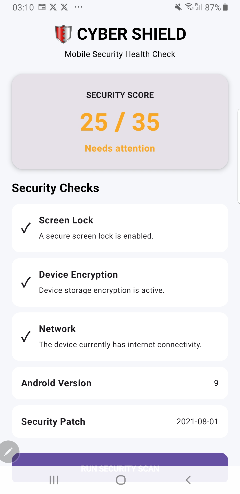
  </a>
  &nbsp;
  <a href="https://play.google.com/store/apps/details?id=com.adnanmalik.intruderalert">
    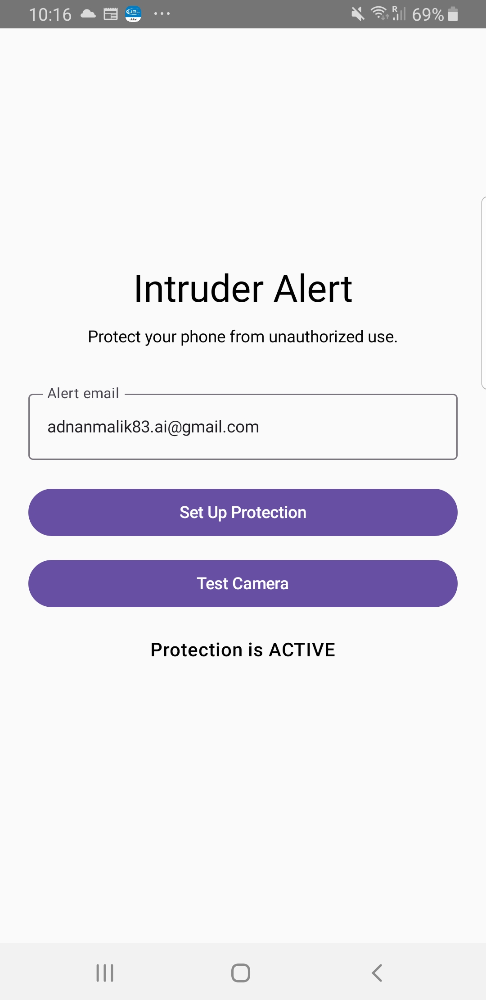
  </a>
  &nbsp;
  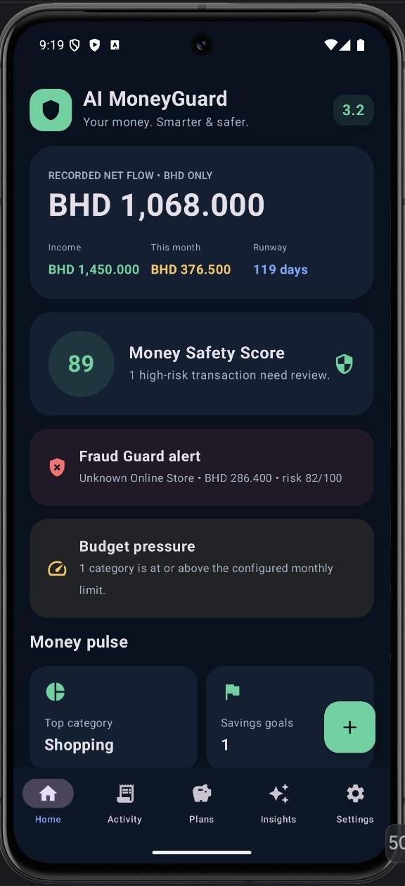
</p>

<p align="center">
  <b>Cyber Shield</b> — Mobile Cybersecurity
  &nbsp; • &nbsp;
  <b>Intruder Alert</b> — Device Security
  &nbsp; • &nbsp;
  <b>AI MoneyGuard</b> — Financial Intelligence
</p>

<p align="center">
  <a href="https://play.google.com/store/apps/details?id=com.adnanmalik.cybershield">
    Cyber Shield ↗
  </a>
  &nbsp;&nbsp; | &nbsp;&nbsp;
  <a href="https://play.google.com/store/apps/details?id=com.adnanmalik.intruderalert">
    Intruder Alert ↗
  </a>
  &nbsp;&nbsp; | &nbsp;&nbsp;
  <b>AI MoneyGuard — Coming Soon</b>
</p>

<div align="center">
  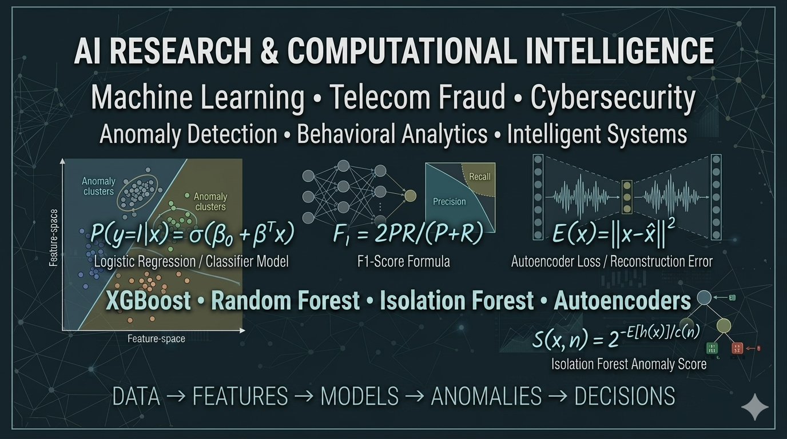
</div>

<div align="center">
---

# 🕸️ Graph Fraud Detection AI

### Discover Connected Fraud Patterns with Graph Neural Networks

<p align="center">
  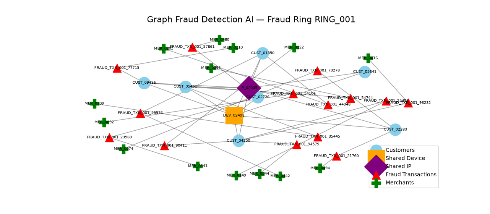
</p>

<p align="center">
  <b>66,399 Nodes</b> •
  <b>328,990 Edges</b> •
  <b>GraphSAGE</b> •
  <b>PyTorch Geometric</b> •
  <b>Graph Neural Networks</b>
</p>

Traditional fraud models often evaluate transactions individually.

**Graph Fraud Detection AI** explores a different approach: representing
customers, transactions, devices, accounts and other entities as a connected
graph.

GraphSAGE learns from both an entity's own characteristics and the behavior
of its neighbouring nodes, helping reveal:

- 🔗 Connected suspicious transactions
- 🕸️ Potential fraud rings
- 📱 Shared devices and infrastructure
- 👥 Related customer activity
- 💳 Connected payment behaviour
- 🔍 Relationships difficult to identify in flat transaction tables

### 🚀 Open-Source Research Project

The repository contains the graph construction pipeline, GraphSAGE model,
training workflow, fraud predictions, evaluation results and fraud-network
visualization.

<p align="center">

[🚀 **Quick Start**](https://github.com/adnanmalik83/Graph-Fraud-Detection-AI#quick-start)
&nbsp;&nbsp; • &nbsp;&nbsp;
[📊 **Results**](https://github.com/adnanmalik83/Graph-Fraud-Detection-AI#results)
&nbsp;&nbsp; • &nbsp;&nbsp;
[🕸️ **Fraud Ring Demo**](https://github.com/adnanmalik83/Graph-Fraud-Detection-AI)
&nbsp;&nbsp; • &nbsp;&nbsp;
[🍴 **Fork & Experiment**](https://github.com/adnanmalik83/Graph-Fraud-Detection-AI/fork)

</p>

### 🧪 Ideas for Community Experiments

Interested researchers and developers can fork the project and experiment with:

- Graph Attention Networks (GAT)
- Temporal Graph Neural Networks
- Alternative node features
- Fraud-ring detection techniques
- Explainable GNN approaches
- Larger synthetic transaction networks
- Different fraud scenarios

> ⭐ **If you find the project useful, consider starring it.**
>
> 🍴 **Want to experiment with another GNN architecture or fraud scenario? Fork the repository and build on it.**

---

# 🌍 FraudPulse AI — Global Fraud Intelligence Network

### Open-Source Global Fraud & Cyber Threat Intelligence Platform

**FraudPulse AI** is an experimental open-source fraud intelligence platform
designed to combine public threat intelligence, campaign discovery, graph
correlation, community signals and agentic investigation into a unified
fraud-monitoring environment.

The project explores an important question:

> **Can independent fraud and cyber-threat signals be correlated early enough
> to identify emerging campaigns before they become widespread?**

<p align="center">
  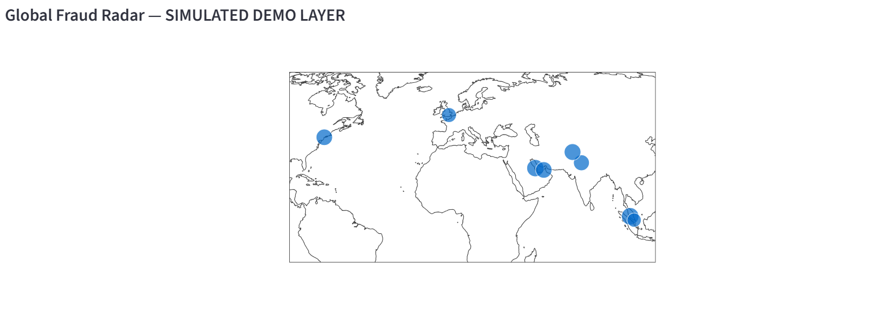
</p>

### 📡 Live Threat Intelligence

FraudPulse integrates external threat-intelligence feeds while maintaining
clear provenance between observed, community-reported and simulated data.

Current capabilities include:

- 🌐 OpenPhish live phishing intelligence
- 🔎 Campaign discovery
- 🚨 Fraud early-warning alerts
- 🧬 Fraud DNA analysis
- 🕸️ Cross-source correlation
- 🤖 Agentic fraud investigation
- 📊 Persistent intelligence storage
- 🌍 Global Fraud Radar
- 🔌 FastAPI intelligence API

<p align="center">
  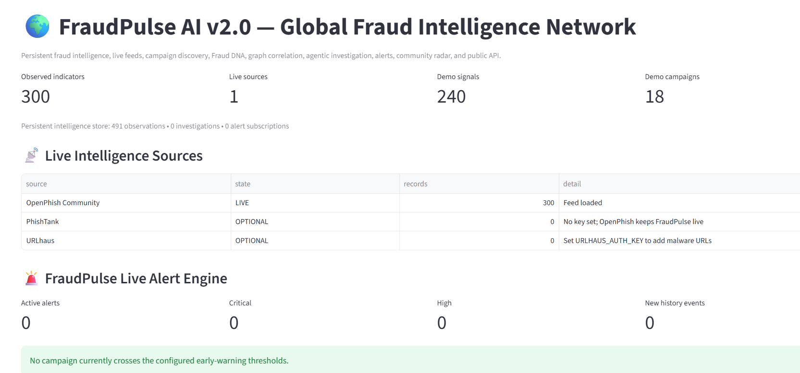
</p>

## 🧠 Agentic Investigation & Intelligence Graph

FraudPulse includes an **Agentic Investigation Desk** where defensive
investigation components independently analyse suspicious content, URLs,
threat-intelligence signals and social-engineering indicators.

The resulting evidence can be connected through a persistent intelligence
graph:

```text
Threat Feed
     │
     ▼
Suspicious Host
     │
     ├──────────► Fraud Theme
     │
     ▼
Campaign
     │
     ├──────────► Community Signal
     │
     ▼
Early-Warning Alert

```
# ADNAN MALIK

### AI RESEARCHER & ENGINEER

**Machine Learning · Telecom Fraud · Cybersecurity · Intelligent AI Systems**

[](https://github.com/adnanmalik83)
[](https://www.linkedin.com/in/adnan-malik-30240928/)
[](https://adnanmalik83.github.io/)

**Independent AI Research & Engineering**

</div>

---

# 🧠 AI Research & Engineering

I build and experiment with **practical artificial intelligence systems for real-world problems**, with a particular focus on:

* **Telecom fraud detection**
* **Cybersecurity analytics**
* **Anomaly detection**
* **Machine-learning benchmarking**
* **Explainable AI**
* **Autonomous AI systems**
* **Fraud and risk intelligence**

My work combines **20+ years of telecommunications revenue assurance and fraud-management experience** with modern machine-learning and AI engineering.

The central question behind much of my work is:

> **How can intelligent systems detect complex, evolving patterns that traditional rules struggle to identify?**

---

# 🔬 Research Focus

```text
                    ARTIFICIAL INTELLIGENCE
                              │
          ┌───────────────────┼───────────────────┐
          │                   │                   │
          ▼                   ▼                   ▼
    MACHINE LEARNING     ANOMALY DETECTION    AI SYSTEMS
          │                   │                   │
          └──────────────┬────┴────┬──────────────┘
                         │         │
                         ▼         ▼
                  TELECOM FRAUD  CYBERSECURITY
                         │         │
                         └────┬────┘
                              ▼
                     INTELLIGENT RISK
                        ANALYTICS
```

### Current research themes

**Machine Learning**

* Supervised learning
* Ensemble learning
* XGBoost
* Random Forest
* Classification
* Model benchmarking

**Anomaly Detection**

* Isolation Forest
* Autoencoders
* Behavioral modelling
* Novel fraud detection
* Unlabelled-data analysis

**Telecom AI**

* IRSF
* Wangiri
* SIM-box / bypass fraud
* Subscription fraud
* Account takeover
* A2P / SMS fraud
* Revenue assurance

**Cybersecurity AI**

* Cyber-fraud detection
* Behavioral threat detection
* Ransomware detection
* Security analytics
* Risk scoring

---

# 📐 Mathematical Foundations

My approach is not limited to using machine-learning libraries. I am interested in the underlying mathematical and statistical mechanisms that allow models to distinguish normal from fraudulent behavior.

### Logistic Classification

[
P(y=1|x)=\sigma(\beta_0+\beta^Tx)
]

where:

* (x) = feature vector
* (\beta) = learned parameters
* (y=1) = fraud
* (\sigma) = sigmoid function

### Precision

[
Precision=\frac{TP}{TP+FP}
]

### Recall

[
Recall=\frac{TP}{TP+FN}
]

### F1 Score

[
F_1=
2\frac{Precision\times Recall}
{Precision+Recall}
]

### Autoencoder Reconstruction Error

[
E(x)=||x-\hat{x}||^2
]

A sufficiently large reconstruction error can indicate behavior that differs substantially from the patterns learned from legitimate activity.

### Isolation Forest

[
s(x,n)=
2^{-\frac{E(h(x))}{c(n)}}
]

where shorter isolation paths indicate observations that are easier to separate from the normal population.

---

# 🧪 Research Methodology

My projects generally follow a repeatable research pipeline:

```text
PROBLEM
   │
   ▼
DATA COLLECTION
   │
   ▼
DATA EXPLORATION
   │
   ▼
FEATURE ENGINEERING
   │
   ▼
MODEL DESIGN
   │
   ▼
EXPERIMENTATION
   │
   ▼
MODEL BENCHMARKING
   │
   ▼
EXPLAINABILITY
   │
   ▼
DEPLOYMENT
   │
   ▼
OBSERVATION & ITERATION
```

The objective is to move beyond:

**"I built an AI application."**

toward:

**"I investigated a problem, tested multiple approaches, measured their behavior and converted the findings into a working system."**

---

<h3>🚨 Intruder Alert</h3>

<p>
A security monitoring application designed to detect suspicious or unauthorized
activity and provide timely security alerts through a practical and intuitive
interface.
</p>

<table>
<tr>
<td align="center">

</td>

<td align="center">
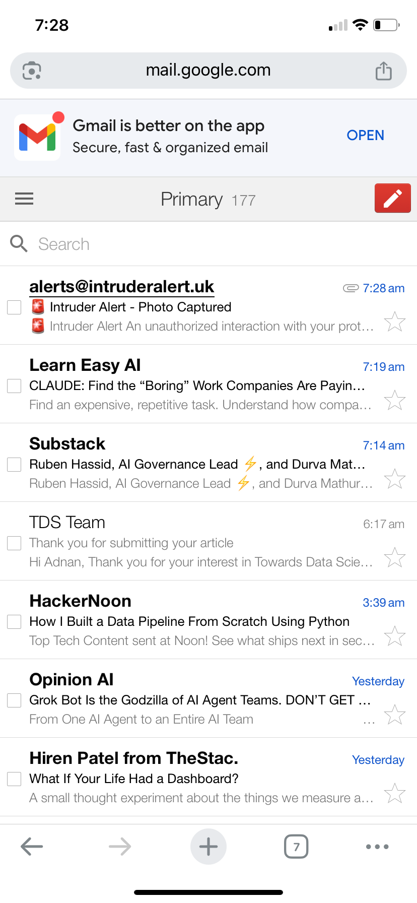
</td>

<td align="center">
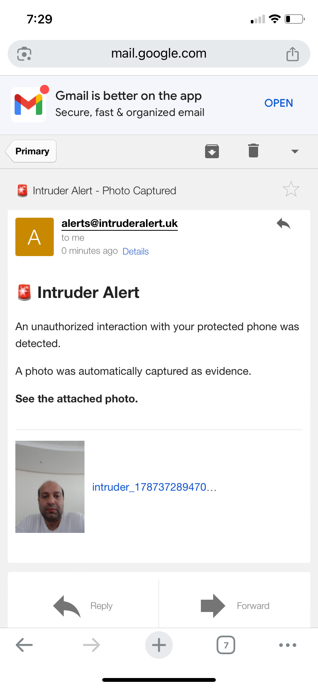
</td>
</tr>
</table>

<p>
  <b>Application:</b> Intrusion Detection &amp; Security Alerts<br>
  <b>Status:</b> Developed &amp; Published<br>
  <b>Download:</b>
  <a href="https://play.google.com/store/apps/details?id=com.adnanmalik.intruderalert"
     target="_blank"
     rel="noopener noreferrer">
    Get it on Google Play
  </a>
</p>

## 🛡️ CyberAware AI

### AI-Powered Cybersecurity & Fraud Awareness Platform

An interactive cybersecurity and fraud-awareness platform developed by **AI Labs**, using scenario-based challenges, scoring, gamification, progress tracking, achievement badges, and certification.

**Key capabilities:**
- 🎣 Phishing awareness
- 📱 SMS fraud detection
- 🧠 Social engineering scenarios
- 🔐 Ransomware response
- ☎️ Telecom fraud awareness
- 🤖 AI threat challenges
- 📊 Cyber awareness scoring
- 🏆 Achievement badges
- 🎓 Certification

**🌐 Live Demo:**  
https://adnanmalik83.github.io/CyberAware-AI/

**💻 Repository:**  
https://github.com/adnanmalik83/CyberAware-AI/

### 📸 Screenshots

<p align="center">
  
  
</p>

<p align="center">
  
  
</p>

<p align="center">
  
</p>


# 🚀 Featured AI Research Projects

## 01 · Telecom Fraud AI Benchmark

### `telecom-fraud-ai-benchmark`

A machine-learning benchmark investigating different approaches to telecom fraud detection.

**Algorithms explored:**

* Logistic Regression
* Decision Trees
* Random Forest
* XGBoost
* Isolation Forest
* Autoencoders

### Research question

> **Which machine-learning technique is most appropriate for different telecom fraud scenarios?**

The benchmark compares supervised and unsupervised approaches rather than assuming that one algorithm is universally optimal.

**Focus:**

`Classification` · `Anomaly Detection` · `Model Comparison` · `Fraud Analytics`

[View Repository →](https://github.com/adnanmalik83/telecom-fraud-ai-benchmark)

---

## 02 · AI Cyber-Fraud Detection

### `AI-Cyber-Fraud-Detection`

A machine-learning cybersecurity analytics platform designed to identify fraudulent and high-risk activity.

**Technology:**

* XGBoost
* Random Forest
* Feature engineering
* Feature importance
* Risk classification
* Streamlit analytics

**Research direction:**

> Applying machine learning to behavioral cybersecurity signals and fraud-event classification.

[View Repository →](https://github.com/adnanmalik83/AI-Cyber-Fraud-Detection)

---

## 03 · AI A2P SMS Fraud Operations Center

### `AI-A2P-SMS-Fraud-Operations-Center`

An AI-driven platform for detecting and analysing fraudulent A2P SMS activity.

The system explores:

* XGBoost
* Random Forest
* Fraud classification
* Operational analytics
* Risk scoring
* Explainable model outputs

The project is particularly focused on translating machine-learning predictions into an **operational fraud-management workflow**.

[View Repository →](https://github.com/adnanmalik83/AI-A2P-SMS-Fraud-Operations-Center)

---

## 04 · OpenTelecomFraudAI

### `OpenTelecomFraudAI`

An open AI-oriented exploration of telecommunications fraud detection and intelligent fraud analytics.

**Research domain:**

`Telecom AI` · `Fraud Detection` · `Revenue Assurance` · `Machine Learning`

[View Repository →](https://github.com/adnanmalik83/OpenTelecomFraudAI)

---

# 🤖 Autonomous & Agentic AI

## 05 · Local-First AI Researcher

### `Local-First-AI-Researcher`

An experimental AI research pipeline exploring local-first research workflows and automated information analysis.

**Research themes:**

* AI research workflows
* Automated information retrieval
* Local-first processing
* Research automation

[View Repository →](https://github.com/adnanmalik83/Local-First-AI-Researcher)

---

## 06 · Autonomous AI Data Analyst

### `Autonomous-AI-Data-Analyst`

An AI-driven data-analysis system exploring how analytical workflows can be automated.

The project investigates the transition from:

```text
Human → Query → Analysis → Visualization
```

toward:

```text
Human
  ↓
AI Analyst
  ↓
Data Understanding
  ↓
Analysis
  ↓
Visualization
  ↓
Insights
```

[View Repository →](https://github.com/adnanmalik83/Autonomous-AI-Data-Analyst)

---
## 07 · AI Face Recognition Alert Pro

### `AI-Face-Recognition-Alert-Pro`

An AI-powered computer-vision security system for **real-time face recognition, unknown-person detection, automated security alerts, evidence capture, event logging, and security analytics**.

The project combines **YuNet face detection** with **SFace facial recognition** to create a local-first security monitoring workflow.

<p align="center">
  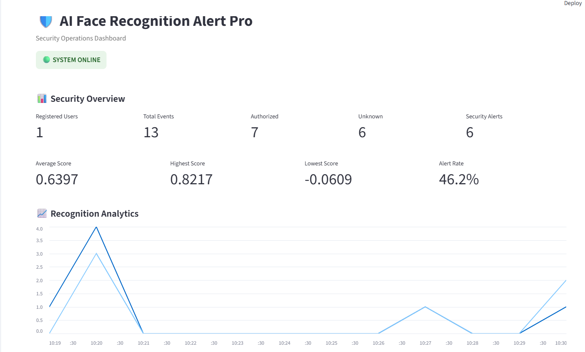
  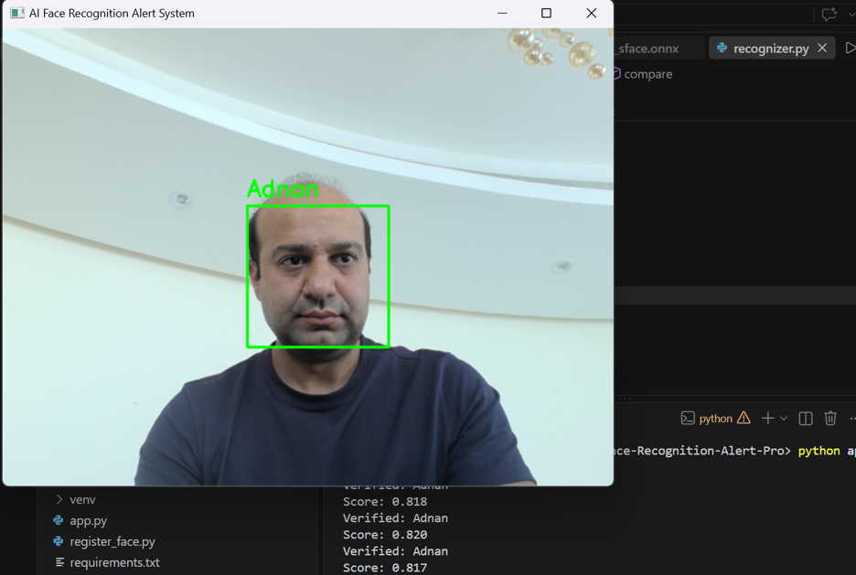
</p>

<p align="center">
  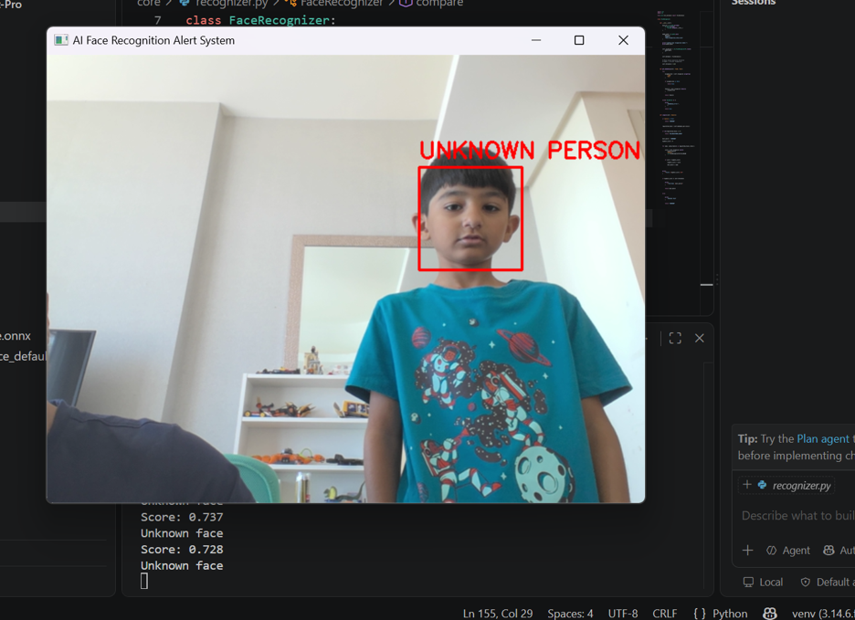
</p>

### Research / engineering question

> **How can AI-based face recognition be integrated with real-time security monitoring, automated alerting, evidence capture, and auditable event analysis?**

Rather than treating face recognition as an isolated computer-vision task, the project connects the AI recognition pipeline with a complete security-monitoring workflow.

### Core capabilities

* Real-time face detection using YuNet
* SFace-based facial feature extraction and recognition
* Authorized-person registration
* Unknown-person detection
* Multi-frame unknown-person confirmation
* Automated security alerts
* Evidence screenshot capture
* Recognition-score tracking
* Security event logging
* Interactive Streamlit security dashboard
* Local-first biometric data processing

### Architecture

```text
Camera
   │
   ▼
YuNet Face Detection
   │
   ▼
Facial Landmarks
   │
   ▼
SFace Alignment
   │
   ▼
SFace Feature Embedding
   │
   ▼
Cosine Similarity
   │
   ├───────────────┐
   ▼               ▼
AUTHORIZED       UNKNOWN
                   │
                   ▼
            Frame Confirmation
                   │
                   ▼
             Security Alert
                   │
          ┌────────┴────────┐
          ▼                 ▼
      Evidence          Event Log
          │                 │
          └────────┬────────┘
                   ▼
          Security Dashboard

```

# 🛡️ Cybersecurity AI

## CyberShield

An AI-oriented cybersecurity project focused on mobile security and threat awareness.

**Technology direction:**

`Android` · `Kotlin` · `Cybersecurity` · `AI`

[View Repository →](https://github.com/adnanmalik83/CyberShield)

<h3>🛡️ CyberShield</h3>

<p>
A cybersecurity application designed to provide users with practical security
monitoring, threat awareness, and protection capabilities through an intuitive
interface.
</p>

<table>
<tr>
<td align="center">

</td>

<td align="center">

</td>

<td align="center">

</td>
</tr>
</table>

<p>
  <b>Application:</b> <a href="https://play.google.com/store/apps/details?id=com.adnanmalik.cybershield">Cybersecurity & Threat Protection</a><br>
  <b>Status:</b> Developed
</p>

---

## Ransomware Canary & Log Analyzer

An experimental cybersecurity project investigating ransomware detection through canary mechanisms and log analysis.

**Research direction:**

```text
Canary Signals
      +
Log Behaviour
      +
Anomaly Detection
      ↓
Early Ransomware Detection
```

[View Repository →](https://github.com/adnanmalik83/Ransomware-Canary-Log-Analyzer)

---

# 📊 AI Applied to Real-World Problems

| Project                             | Research / Engineering Area |
| ----------------------------------- | --------------------------- |
| **Telecom Fraud AI Benchmark**      | ML benchmarking             |
| **AI Cyber-Fraud Detection**        | Cybersecurity AI            |
| **A2P SMS Fraud Operations Center** | Telecom fraud               |
| **OpenTelecomFraudAI**              | Telecom AI                  |
| **Local-First AI Researcher**       | AI research automation      |
| **Autonomous AI Data Analyst**      | Autonomous analytics        |
| **CyberShield**                     | Mobile cybersecurity        |
| **Ransomware Canary**               | Ransomware detection        |
| **SmartRecruit-AI**                 | NLP / semantic matching     |
| **AI SEO Optimizer**                | Applied AI automation       |

---

# 🔍 Fraud Detection: Algorithm Selection

One of my core research interests is understanding that **different fraud mechanisms require different analytical approaches**.

| Fraud Type                       | Potentially Suitable Approach          |
| -------------------------------- | -------------------------------------- |
| **IRSF**                         | XGBoost / Random Forest                |
| **Wangiri**                      | XGBoost + Rules                        |
| **SIM-box / Bypass**             | Random Forest + Anomaly Detection      |
| **Subscription Fraud**           | XGBoost / Random Forest                |
| **Account Takeover**             | XGBoost + Behavioral Anomaly Detection |
| **A2P / SMS Fraud**              | XGBoost / Random Forest                |
| **Unknown Fraud**                | Isolation Forest / Autoencoder         |
| **Limited Labels**               | Anomaly Detection                      |
| **Highly Explainable Decisions** | Logistic Regression / Decision Tree    |

The goal is not to identify a universally "best" algorithm.

The goal is to identify the **most appropriate analytical technique for the characteristics of the fraud problem**.

---

# 🧬 From Rules to Intelligent Fraud Systems

Traditional fraud management often follows:

```text
EVENT
  ↓
RULE
  ↓
ALERT
  ↓
INVESTIGATION
```

My research direction explores:

```text
                         TELECOM EVENTS
                               │
                               ▼
                       FEATURE ENGINEERING
                               │
             ┌─────────────────┼─────────────────┐
             ▼                 ▼                 ▼
           RULES          SUPERVISED ML      ANOMALY ML
             │                 │                 │
             └─────────────────┼─────────────────┘
                               ▼
                         RISK FUSION
                               │
                               ▼
                        FRAUD RISK SCORE
                               │
                 ┌─────────────┼─────────────┐
                 ▼             ▼             ▼
              MONITOR        ALERT        ACTION
```

This represents a transition from **static detection** toward **adaptive behavioral intelligence**.

---

# 📈 Research & Experimentation

I believe AI engineering should be supported by measurable experiments.

Typical evaluation includes:

* Accuracy
* Precision
* Recall
* F1-score
* ROC-AUC
* Confusion matrices
* Precision-Recall curves
* Feature importance
* Model training time
* False-positive analysis

For fraud detection, accuracy alone is insufficient.

A model that achieves high accuracy while missing significant fraud can be operationally ineffective.

---

# 🏗️ Engineering Philosophy

### Research

**Understand the problem before choosing the model.**

### Experimentation

**Compare algorithms rather than assuming one is best.**

### Explainability

**Understand why the model produces a prediction.**

### Deployment

**Turn research into a usable system.**

### Iteration

**Treat every deployed system as an opportunity to generate new research questions.**

---

# 🧭 Research Roadmap

### Completed / Active

* [x] Supervised fraud classification
* [x] Telecom fraud benchmarking
* [x] XGBoost experiments
* [x] Random Forest experiments
* [x] Anomaly detection experiments
* [x] AI cybersecurity analytics
* [x] A2P/SMS fraud analytics
* [x] Autonomous AI experimentation

### Next Research Directions

* [ ] Explainable AI with SHAP
* [ ] Concept-drift detection
* [ ] Real-time fraud scoring
* [ ] Streaming fraud analytics
* [ ] Graph-based fraud detection
* [ ] Temporal behavioural modelling
* [ ] Hybrid rule + ML detection
* [ ] Human-in-the-loop fraud investigation
* [ ] LLM-assisted fraud analysis
* [ ] Multi-model risk fusion

---

# 🏢 Professional Background

My AI work builds on more than **20 years of telecommunications experience** across revenue assurance, fraud management, billing integrity and telecom technology.

Experience includes work involving major telecom environments including:

* **stc Bahrain**
* **Vodafone Qatar**
* **Etisalat / Ufone Pakistan**

Areas of professional expertise include:

* Revenue Assurance
* Fraud Management
* Telecom Billing
* Roaming
* Interconnect
* Wholesale
* Rating & Charging
* Fraud Management Systems
* AI/ML Fraud Analytics

This combination of **domain expertise + AI engineering** is central to my current research direction.

---

# 📚 Education

**EMBA Coursework** — NUST

**Bachelor of Computer Software Engineering**
Foundation University

---

# 🌐 Research & Professional Presence

### Website

[AI Labs — AI Software & Research](https://adnanmalik83.github.io/)

### LinkedIn

[Adnan Malik](https://www.linkedin.com/in/adnan-malik-30240928/)

### GitHub

[github.com/adnanmalik83](https://github.com/adnanmalik83)

---

# 📫 Contact

For research, collaboration and professional opportunities:

**Email:** [adnan_malik_83@hotmail.com](mailto:adnan_malik_83@hotmail.com)

**LinkedIn:** [linkedin.com/in/adnan-malik-30240928](https://www.linkedin.com/in/adnan-malik-30240928/)

---

<div align="center">

### RESEARCH · EXPERIMENT · BENCHMARK · DEPLOY

**Artificial Intelligence for Real-World Problems**

</div>
